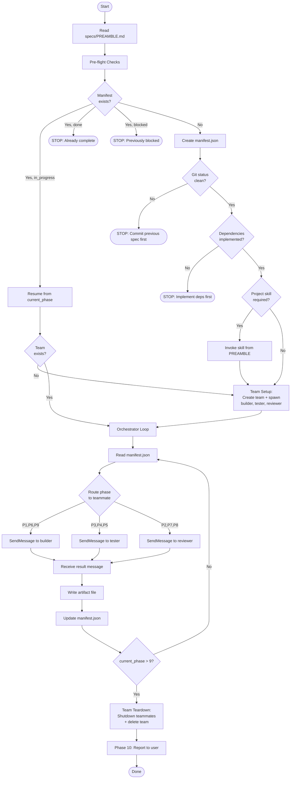

# Spec Implementation Workflow

A generic workflow for implementing specs from a `specs/` directory using persistent agent teams with retained context across phases.

## Requirements

This skill requires a project-specific `specs/PREAMBLE.md` file. To generate one:

```
/implement-spec init
```

---

## Workflow Flowchart



---

## CRITICAL RULES

1. For EACH phase, send a message to the appropriate teammate via `SendMessage` (see Teammate Role Assignments)
2. **Send `specs/PREAMBLE.md` contents in each teammate's FIRST message only** — subsequent messages include a reference reminder instead
3. **Replace all `{{PLACEHOLDERS}}` with actual values**
4. Pass ONLY essential context between phases — read the `latest` artifact from the manifest, not full conversation history
5. **Read and update `progress/spec-NN/manifest.json` before and after EVERY phase**
6. After each teammate responds, the **lead** writes the artifact file and updates the manifest
7. Respect iteration limits — STOP and report if exceeded
8. **DO NOT** proceed to a phase unless the manifest shows it as the `current_phase`
9. **DO NOT** do any phase work inline — every phase goes through a teammate message
10. **Teammates may handle consecutive phases of their type** (e.g., tester receives Phase 3 then Phase 4 as separate messages), but each phase is still a separate message/response cycle with its own artifact
11. **Tasks (TaskCreate/TaskUpdate) are for spec-level tracking only** (e.g., "Implement spec 08"). DO NOT create tasks for individual phases — the manifest handles phase tracking.
12. **Create exactly ONE team per spec.** Tear it down after Phase 10. Do NOT reuse teams across specs.
13. **If a teammate fails to respond**, retry once. If still no response, fall back to spawning a fresh Task agent (subagent_type: "general-purpose") for that single phase only.

---

## TEAMMATE ROLE ASSIGNMENTS

### Role Table

| Teammate | Type | Phases | Responsibilities |
|----------|------|--------|-----------------|
| **builder** | general-purpose | 1 (Implement), 6 (Fix), 9 (Commit) | Implements code, fixes test/review failures, commits. Retains implementation decisions across fix loops. |
| **tester** | general-purpose | 3 (Unit Tests), 4 (E2E Tests), 5 (Run Tests) | Writes and runs all tests. Understands test structure when interpreting failures. |
| **reviewer** | general-purpose | 2 (Verify), 7 (Screenshots), 8 (Code Review) | All verification/review phases. Builds consistent understanding of acceptance criteria. |
| **lead** | orchestrator (you) | Pre-flight, manifest, loop logic, Phase 10 | Manages team lifecycle, routes work, writes artifacts, controls loops, reports to user. |

### Phase-to-Teammate Routing

```
Phase 1  (Implement)      → builder
Phase 2  (Verify)         → reviewer
Phase 3  (Unit Tests)     → tester
Phase 4  (E2E Tests)      → tester
Phase 5  (Run Tests)      → tester
Phase 6  (Fix Failures)   → builder
Phase 7  (Screenshots)    → reviewer
Phase 8  (Code Review)    → reviewer
Phase 9  (Commit)         → builder
Phase 10 (Report)         → lead (direct, no message)
```

### Context Retention Wins

1. **builder Phase 1 → Phase 6**: When tests fail, the builder already knows WHY it made implementation decisions. No need to re-read every file and re-derive the architecture. This is the biggest win — the fix loop (Phase 5 → 6 → 5 → 6...) can iterate up to 5 times, and each Phase 6 currently starts from scratch.
2. **builder Phase 6 → Phase 6 (subsequent iterations)**: On the second or third fix attempt, the builder remembers what it already tried and failed. No duplicate fixes.
3. **tester Phase 3 → Phase 4**: After writing unit tests, the tester already understands the component structure and can write better E2E tests targeting the same behaviors.
4. **tester Phase 3/4 → Phase 5**: The tester who wrote the tests knows their intent when reading failure output. Better root cause identification.
5. **reviewer Phase 2 → Phase 7 → Phase 8**: The reviewer builds a deep understanding of the spec's acceptance criteria in Phase 2, then applies that same understanding when reviewing screenshots and code quality.
6. **builder Phase 1 → Phase 9**: The builder has full implementation context for writing a meaningful commit message.

---

## HOW TO CONSTRUCT TEAMMATE MESSAGES

**First message to a teammate:**
```
┌─────────────────────────────────────┐
│  Contents of specs/PREAMBLE.md      │
│  (project context, standards, etc.) │
├─────────────────────────────────────┤
│  [PHASE N: PHASE_NAME]             │
│  Phase template with {{FILLED}}     │
│  placeholder values                 │
├─────────────────────────────────────┤
│  CONTEXT FROM PREVIOUS PHASES:      │
│  - Artifact data per dependency     │
│    table                            │
│  - Iteration counts from manifest   │
└─────────────────────────────────────┘
```

**Subsequent messages to same teammate:**
```
┌─────────────────────────────────────┐
│  PREAMBLE REMINDER: "Refer to the  │
│  PREAMBLE provided in your initial  │
│  message for project context,       │
│  coding standards, test structure." │
├─────────────────────────────────────┤
│  [PHASE N: PHASE_NAME]             │
│  Phase template with {{FILLED}}     │
│  placeholder values                 │
├─────────────────────────────────────┤
│  CONTEXT FROM PREVIOUS PHASES:      │
│  - Artifact data per dependency     │
│    table                            │
│  - Iteration counts from manifest   │
└─────────────────────────────────────┘
```

**Message framing convention** — Phase headers help teammates track which phase they're executing:
- Lead sends: `[PHASE N: PHASE_NAME]`
- Teammate responds: `[PHASE N RESULT]` followed by JSON artifact

**PREAMBLE tracking** — The lead maintains a mental flag per teammate:
```
preamble_sent = { builder: false, tester: false, reviewer: false }
```
Set to `true` after first message to each teammate.

---

## LOOP SUMMARY

| Loop | Trigger | Action | Max Attempts |
|------|---------|--------|--------------|
| **Verify Loop** | Phase 2 fails | Return to Phase 1 (re-implement) | 3 |
| **Test Fix Loop** | Phase 5 fails | Phase 6 fixes → Phase 5 re-runs | 5 |
| **Screenshot Loop** | Phase 7 finds issues | Phase 6 fixes → Phase 5 re-runs | (shares test fix count) |
| **Refactor Loop** | Phase 8 needs refactor | Fix → Phase 5 re-runs | 3 |

---

## PROGRESS TRACKING

All state is persisted to disk in `progress/spec-NN/`. This enables resume after context loss and prevents skipping phases.

### Manifest Schema

File: `progress/spec-NN/manifest.json`

```json
{
  "spec_number": "08",
  "spec_path": "specs/08-scenario-3-notifications.md",
  "spec_name": "scenario-3-notifications",
  "page_url": "/notifications",
  "status": "in_progress",
  "current_phase": 5,
  "next_sequence": 10,
  "iterations": { "verify": 0, "test_fix": 0, "refactor": 0 },
  "phases": {
    "1_implement":   { "status": "pending", "latest": null },
    "2_verify":      { "status": "pending", "latest": null },
    "3_unit_tests":  { "status": "pending", "latest": null },
    "4_e2e_tests":   { "status": "pending", "latest": null },
    "5_run_tests":   { "status": "pending", "latest": null },
    "6_fix":         { "status": "pending", "latest": null },
    "7_screenshots": { "status": "pending", "latest": null },
    "8_code_review": { "status": "pending", "latest": null },
    "9_commit":      { "status": "pending", "latest": null }
  }
}
```

### Artifact Naming

Each sub-agent's JSON response is saved as an artifact file in `progress/spec-NN/`.

Format: `{sequence:03d}-p{phase:02d}-{slug}.json`

Example: `004-p05-run-tests.json`

Slugs by phase:

| Phase | Slug |
|-------|------|
| 1 | `implement` |
| 2 | `verify` |
| 3 | `unit-tests` |
| 4 | `e2e-tests` |
| 5 | `run-tests` |
| 6 | `fix` |
| 7 | `screenshots` |
| 8 | `code-review` |
| 9 | `commit` |

---

## ARTIFACT DEPENDENCIES

Each phase may require data from previous phases' artifacts. **Always read the `latest` artifact** from the manifest — phases can run multiple times, and only the most recent artifact is valid.

### Dependency Table

| Phase | Requires Artifacts From | Fields to Extract |
|-------|------------------------|-------------------|
| 1 | (none) | — |
| 2 | `1_implement` | `files_created`, `files_modified` |
| 3 | `1_implement` | `files_created` |
| 4 | `1_implement` | `files_created` |
| 5 | (manifest only) | `iterations.test_fix` (for browser selection) |
| 6 | `5_run_tests` | `typecheck.errors`, `unit_tests.errors`, `e2e_tests.errors` |
| 7 | `4_e2e_tests` | `screenshots_will_capture` |
| 8 | `1_implement`, `3_unit_tests`, `4_e2e_tests` | `files_created`, `test_files_created`, `e2e_files_created` |
| 9 | `1_implement`, `5_run_tests` | `summary`, `unit_tests.total`, `e2e_tests.total` |

### How to Read Artifacts

```
1. Look up the artifact filename from manifest:
   artifact_file = manifest.phases["1_implement"].latest
   // e.g., "003-p01-implement.json"

2. Read the full path:
   progress/spec-NN/{artifact_file}

3. Parse JSON and extract required fields

4. If latest is null, the phase hasn't run yet (error in flow)
```

**Important:** When a phase re-runs (e.g., Phase 1 after failed verification), a NEW artifact is created and `latest` is updated. Previous artifacts remain on disk but should be ignored — always use `latest`.

---

## PRE-FLIGHT CHECKS (Do these yourself, not via agent)

0. **Check for existing manifest:** Look for `progress/spec-{{SPEC_NUMBER}}/manifest.json`
   - If it exists and `status` is `"in_progress"` → **resume** from `current_phase` (skip remaining pre-flight, go to TEAM SETUP then ORCHESTRATOR LOOP)
   - If it exists and `status` is `"done"` → tell user this spec is already complete, **STOP**
   - If it exists and `status` is `"blocked"` → tell user previous run was blocked, show manifest contents, **STOP**
   - If it doesn't exist → create the `progress/spec-{{SPEC_NUMBER}}/` directory and initial `manifest.json` (all phases pending, `current_phase: 1`, `next_sequence: 1`, `status: "in_progress"`), then continue pre-flight

1. Read `specs/PREAMBLE.md` for project context
   - If missing, tell user to run `/implement-spec init`
2. Read the target spec file: `specs/{{SPEC_NUMBER}}-*.md`
3. Read the spec's "Dependencies" section
4. Verify each dependency spec is implemented (check if files exist)
5. If dependencies missing, **STOP** and tell user which specs must be implemented first
6. **Check for uncommitted changes:**
   ```bash
   git status --short
   ```

   **If any uncommitted files exist:**
   - Show the list to the user
   - **STOP** and say: "Found uncommitted changes from a previous spec implementation. These need to be committed before implementing spec {{SPEC_NUMBER}}, since specs build on each other sequentially."
   - List the uncommitted files
   - Ask the user: "Which spec do these files belong to? I can help commit them now with the proper commit message, or you can commit them manually."
   - **Do not proceed** until the working directory is clean

   **If working directory is clean (no output from git status):**
   - Continue to step 7

7. Check PREAMBLE's "Project-Specific Skills" table:
   - If this spec matches a pattern, invoke that skill before proceeding
8. For external libraries/APIs mentioned in the spec:
   - Check if documentation is cached locally
   - If missing, use `/documentation-creator` to fetch it

---

## TEAM SETUP

Create the team and spawn teammates before entering the orchestrator loop.

### Steps

1. **Create the team:**
   ```
   TeamCreate({
     team_name: "spec-{SPEC_NUMBER}",
     description: "Implementing spec {SPEC_NUMBER}: {SPEC_NAME}"
   })
   ```

2. **Spawn all three teammates in a SINGLE message** (parallel initialization):
   ```
   // All three in one message for parallel spawn:

   Task({
     team_name: "spec-{SPEC_NUMBER}",
     name: "builder",
     subagent_type: "general-purpose",
     prompt: "You are the BUILDER teammate on team spec-{SPEC_NUMBER}.

   YOUR ROLE: Implement code (Phase 1), fix test/review failures (Phase 6), and commit (Phase 9).

   WORKFLOW:
   - The lead will send you phase assignments via message
   - Each message contains a [PHASE N: NAME] header and detailed instructions
   - Do the work described (read files, write code, run commands as needed)
   - Respond with ONLY a [PHASE N RESULT] header followed by the JSON artifact described in the instructions
   - Do NOT take any action until you receive a phase assignment

   Wait for your first assignment."
   })

   Task({
     team_name: "spec-{SPEC_NUMBER}",
     name: "tester",
     subagent_type: "general-purpose",
     prompt: "You are the TESTER teammate on team spec-{SPEC_NUMBER}.

   YOUR ROLE: Write unit tests (Phase 3), write E2E tests (Phase 4), and run all tests (Phase 5).

   WORKFLOW:
   - The lead will send you phase assignments via message
   - Each message contains a [PHASE N: NAME] header and detailed instructions
   - Do the work described (read files, write tests, run test commands as needed)
   - Respond with ONLY a [PHASE N RESULT] header followed by the JSON artifact described in the instructions
   - Do NOT take any action until you receive a phase assignment

   Wait for your first assignment."
   })

   Task({
     team_name: "spec-{SPEC_NUMBER}",
     name: "reviewer",
     subagent_type: "general-purpose",
     prompt: "You are the REVIEWER teammate on team spec-{SPEC_NUMBER}.

   YOUR ROLE: Verify implementation (Phase 2), review screenshots (Phase 7), and code review (Phase 8).

   WORKFLOW:
   - The lead will send you phase assignments via message
   - Each message contains a [PHASE N: NAME] header and detailed instructions
   - Do the work described (read files, check criteria, review images as needed)
   - Respond with ONLY a [PHASE N RESULT] header followed by the JSON artifact described in the instructions
   - Do NOT take any action until you receive a phase assignment

   Wait for your first assignment."
   })
   ```

3. **Initialize PREAMBLE tracking:**
   ```
   preamble_sent = { builder: false, tester: false, reviewer: false }
   ```

### Resume Handling

When resuming from a manifest (`status: "in_progress"`), the team must still be created fresh — teams do not persist across sessions. The manifest tells the lead which phase to resume from, so no work is lost. Teammates start with clean context on resume, but receive PREAMBLE + relevant artifact context in their first message, which matches the information a fresh Task agent would have received in the current system.

---

## ORCHESTRATOR LOOP

This is the core execution loop. Follow it mechanically — no shortcuts.

```
1. Read progress/spec-NN/manifest.json
2. phase = current_phase from manifest
3. Determine teammate for this phase (Phase-to-Teammate Routing table)
4. Construct the message:
   a. If preamble_sent[teammate] is false:
      - Prepend full PREAMBLE contents
      - Set preamble_sent[teammate] = true
   b. If preamble_sent[teammate] is true:
      - Prepend PREAMBLE reminder text
   c. Add phase header: [PHASE {N}: {PHASE_NAME}]
   d. Append phase template with filled placeholders
   e. Append artifact context from previous phases (per Dependency Table)
5. Send message to teammate:
   SendMessage({
     type: "message",
     recipient: "{teammate}",
     content: "{constructed message}",
     summary: "Phase {N}: {phase_name} for spec {SPEC_NUMBER}"
   })
6. Wait for teammate's response message (automatic delivery)
7. Parse JSON artifact from response
8. Write artifact to progress/spec-NN/{next_sequence:03d}-p{phase:02d}-{slug}.json
9. Update manifest.json:
   a. Update phase's "latest" to point to the new artifact filename
   b. Increment next_sequence
   c. Apply LOOP LOGIC (from the phase's section) to determine next current_phase:
      - If phase succeeded and no loop needed: mark phase "done", advance current_phase
      - If phase failed and loop limit not reached: mark target phase "in_progress",
        set current_phase to loop target, increment iteration counter
      - If phase failed and loop limit reached: set status to "blocked", proceed to TEAM TEARDOWN, then STOP
   d. Write updated manifest
10. If current_phase > 9: set manifest status to "done", proceed to TEAM TEARDOWN, then Phase 10
11. Otherwise: go to step 1
```

### Teammate Failure Handling

If a teammate does not respond or sends invalid JSON:
1. Send a follow-up message asking them to re-send as JSON only
2. If second attempt fails:
   a. Log the failure
   b. Fall back to spawning a fresh Task agent for this phase:
      ```
      Task({
        subagent_type: "general-purpose",
        prompt: "{full prompt with PREAMBLE + phase template + artifacts}"
      })
      ```
   c. Continue the orchestrator loop with the Task agent's response
   d. The teammate remains available in the team for future phases

### Example: Preparing Phase 8 Message (Multi-Artifact)

Phase 8 (Code Review) requires artifacts from phases 1, 3, and 4. Here's how to construct the message to the reviewer:

```
1. Read each artifact's filename from manifest:
   manifest.phases["1_implement"].latest  → "003-p01-implement.json"
   manifest.phases["3_unit_tests"].latest → "005-p03-unit-tests.json"
   manifest.phases["4_e2e_tests"].latest  → "006-p04-e2e-tests.json"

2. Read each artifact file and extract the relevant field:
   Phase 1: { "files_created": ["src/pages/Dashboard.tsx", "src/hooks/useDashboard.ts"] }
   Phase 3: { "test_files_created": ["tests/unit/Dashboard.test.tsx"] }
   Phase 4: { "e2e_files_created": ["tests/e2e/06-dashboard.spec.ts"] }

3. Concatenate arrays to build {{ALL_FILES_CREATED}}:
   → [
       "src/pages/Dashboard.tsx",
       "src/hooks/useDashboard.ts",
       "tests/unit/Dashboard.test.tsx",
       "tests/e2e/06-dashboard.spec.ts"
     ]

4. Fill placeholder in Phase 8 template:
   FILES TO REVIEW: ["src/pages/Dashboard.tsx", "src/hooks/useDashboard.ts", ...]

5. Send via SendMessage to "reviewer" with summary "Phase 8: code review for spec NN"
```

---

## PHASE 1: IMPLEMENT (→ builder)

```
TASK: Implement spec {{SPEC_PATH}}

PREPARATION:
1. Read `specs/PREAMBLE.md` for:
   - Reference files to read
   - Coding standards to follow
   - Path alias conventions

2. Read the target spec for:
   - "File Structure" section → create exactly these files
   - "Dependencies" section → import from these
   - "Acceptance Criteria" → your success checklist
   - "Test Requirements" → what tests are expected

3. Read dependency specs and reference files listed in PREAMBLE

IMPORT AVAILABILITY:
You are implementing spec {{SPEC_NUMBER}}.
- Check the "Available by Spec" table in PREAMBLE
- You may ONLY import from specs with number < {{SPEC_NUMBER}}
- If spec 01: No shared imports exist yet - create everything from scratch
- For complete export lists, read the dependency spec files

IMPLEMENTATION RULES:
- Follow coding standards from PREAMBLE
- Use shared components/hooks/types ONLY from specs numbered lower than yours
- Add data-testid attributes to interactive elements

CREATE:
- All files listed in "File Structure"
- Export from index.ts files as shown in spec

RETURN JSON:
{
  "status": "SUCCESS | PARTIAL | BLOCKED",
  "summary": "...",
  "files_created": ["path1", "path2"],
  "files_modified": ["path3"],
  "decisions": ["chose X because Y"],
  "blocked_by": []
}
```

**LOOP LOGIC:** Mark phase 1 done, advance `current_phase` to 2.

---

## PHASE 2: VERIFY IMPLEMENTATION (→ reviewer)

```
TASK: Verify implementation matches spec

INPUTS:
- Spec: {{SPEC_PATH}}
- Files created: {{FILES_CREATED}}
- PREAMBLE: specs/PREAMBLE.md

VERIFICATION STEPS:
1. Read the spec's "File Structure" section
   - Verify each file exists
   - Verify file locations match exactly

2. Read the spec's "Acceptance Criteria" section
   - Check each criterion (checkbox item)
   - Mark as PASS or FAIL with reason

3. Read each implemented file
   - Verify imports follow PREAMBLE's coding standards
   - Verify types/components from reference files are used (not recreated)

4. Check for data-testid attributes on:
   - Buttons, inputs, forms
   - Key display elements

RETURN JSON:
{
  "status": "SUCCESS | PARTIAL | BLOCKED",
  "summary": "...",
  "verification_passed": true | false,
  "acceptance_criteria": [
    {"criterion": "...", "passed": true|false, "reason": "..."}
  ],
  "missing_files": [],
  "issues": []
}
```

**LOOP LOGIC:**
- If `verification_passed: true` → Mark phase 2 done, advance `current_phase` to 3
- If `verification_passed: false` and `iterations.verify` < 3 → Increment `iterations.verify`, set `current_phase` to 1
- If `verification_passed: false` and `iterations.verify` >= 3 → Set manifest `status` to `"blocked"`, **STOP**

---

## PHASE 3: UNIT TESTS (→ tester)

```
TASK: Write unit tests for spec {{SPEC_PATH}}

READ FIRST:
- specs/PREAMBLE.md for test structure and patterns
- Testing spec referenced in PREAMBLE (if any)
- Existing mocks in the project (location from PREAMBLE)
- The spec's "Test Requirements" section

FILES TO TEST: {{FILES_CREATED}}

REQUIREMENTS:
1. Follow test file structure from PREAMBLE
2. Use existing mocks from PREAMBLE's mock directory (don't recreate)
3. Use testing patterns from PREAMBLE or testing spec
4. Test the test cases listed in the spec's "Test Requirements"
5. Test error states and edge cases

RETURN JSON:
{
  "status": "SUCCESS | PARTIAL | BLOCKED",
  "summary": "...",
  "test_files_created": ["path1", "path2"],
  "test_count": 15,
  "coverage_areas": ["component rendering", "hook behavior", "error states"]
}
```

**LOOP LOGIC:** Mark phase 3 done, advance `current_phase` to 4.

---

## PHASE 4: E2E TESTS (→ tester)

```
TASK: Write E2E tests for spec {{SPEC_PATH}}

READ FIRST:
- specs/PREAMBLE.md for E2E patterns and test structure
- E2E config file (if exists)

SPEC INFO:
- Spec: {{SPEC_PATH}}
- Page URL: {{PAGE_URL}}

REQUIREMENTS:
1. Follow E2E file structure from PREAMBLE
2. Use data-testid selectors (added in Phase 1)
3. Test the full user flow described in spec
4. Add console error capture to EVERY test:

   const consoleErrors: string[] = [];
   page.on('console', msg => {
     if (msg.type() === 'error') consoleErrors.push(msg.text());
   });
   // At test end:
   expect(consoleErrors).toHaveLength(0);

5. Take screenshots at key points (location from PREAMBLE):
   - Initial page load
   - After main action
   - Success/completion state
   - Error states (if testable)

RETURN JSON:
{
  "status": "SUCCESS | PARTIAL | BLOCKED",
  "summary": "...",
  "e2e_files_created": ["path"],
  "screenshots_will_capture": ["path1", "path2"],
  "flows_tested": ["description of flows"]
}
```

**LOOP LOGIC:** Mark phase 4 done, advance `current_phase` to 5.

---

## PHASE 5: RUN TESTS (→ tester)

```
TASK: Run tests for the implemented spec

TEST COMMANDS:
1. Typecheck: (from PREAMBLE's Test Commands)
2. Unit tests: (from PREAMBLE's Test Commands)
3. E2E tests - FILTERED to this spec only:

   # During fix loops (iterations 1-4): single browser for faster feedback
   FORCE_COLOR=0 npx playwright test tests/e2e/{{SPEC_NUMBER}}-*.spec.ts --project=chromium --reporter=line

   # Final verification (iteration 5 or when chromium passes): all browsers
   FORCE_COLOR=0 npx playwright test tests/e2e/{{SPEC_NUMBER}}-*.spec.ts --reporter=line

OUTPUT HANDLING:
- Typecheck: Capture all output (usually small)
- Unit tests: Capture all output (manageable)
- E2E tests:
  - The --reporter=line flag produces concise output with detailed errors
  - FORCE_COLOR=0 disables ANSI escape codes for cleaner output
  - Each failure references an error-context.md file - read these for debugging details
  - Look for PATTERNS in failures (same assertion failing = fix root cause first)
  - For more details, read: .claude/skills/implement-spec/docs/e2e-test-output.md

ITERATION STRATEGY:
- Iterations 1-4: Run E2E with --project=chromium only (faster feedback loop)
- Iteration 5 (or when chromium passes): Run E2E on all browsers for final verification

RETURN JSON:
{
  "status": "SUCCESS | PARTIAL | BLOCKED",
  "summary": "...",
  "typecheck": {"passed": true|false, "errors": []},
  "unit_tests": {"passed": true|false, "total": N, "failed": N, "errors": []},
  "e2e_tests": {"passed": true|false, "total": N, "failed": N, "errors": []},
  "all_passed": true|false
}
```

**LOOP LOGIC:**
- If `all_passed: true` → Mark phase 5 done, advance `current_phase` to 7
- If `all_passed: false` and `iterations.test_fix` < 5 → Set `current_phase` to 6
- If `all_passed: false` and `iterations.test_fix` >= 5 → Set manifest `status` to `"blocked"`, **STOP**

---

## PHASE 6: FIX FAILURES (→ builder)

```
TASK: Fix test failures

FAILURES TO FIX:
{{TEST_ERRORS}}

ANALYSIS APPROACH:
1. For each failure, determine:
   - Is this a TEST bug (test is wrong)?
   - Is this an IMPLEMENTATION bug (code is wrong)?

2. Read the failing test file
3. Read the implementation file being tested
4. Compare against the spec requirements

FIXING RULES:
- Prefer fixing implementation over tests
- Only fix tests if the test is actually wrong
- Don't delete tests to make them pass
- Don't add try/catch to silence errors

RETURN JSON:
{
  "status": "SUCCESS | PARTIAL | BLOCKED",
  "summary": "...",
  "fixes_applied": [
    {"file": "...", "issue": "...", "fix": "..."}
  ],
  "root_causes": ["..."]
}
```

**LOOP LOGIC:** Mark phase 6 done, increment `iterations.test_fix`, set `current_phase` to 5.

---

## PHASE 7: REVIEW SCREENSHOTS (→ reviewer)

```
TASK: Review E2E screenshots for visual issues

SCREENSHOTS TO REVIEW: {{SCREENSHOTS_TO_REVIEW}}
SCREENSHOTS DIRECTORY: (from PREAMBLE's test structure)

FOR EACH SCREENSHOT:
1. Use the Read tool to view the image file
2. Check for:
   - Layout issues (overlapping elements, broken alignment)
   - Missing UI elements (buttons, inputs, labels)
   - Incorrect text or values
   - Broken styling (missing colors, borders)
   - Console error indicators in UI

3. Also check E2E test output for any console.error() messages captured

RETURN JSON:
{
  "status": "SUCCESS | PARTIAL | BLOCKED",
  "summary": "...",
  "screenshots_reviewed": N,
  "visual_issues": [
    {"screenshot": "path", "issue": "description"}
  ],
  "js_errors": [],
  "all_clear": true|false
}
```

**LOOP LOGIC:**
- If `all_clear: true` → Mark phase 7 done, advance `current_phase` to 8
- If `all_clear: false` → Set `current_phase` to 6 (fix issues, then re-run tests)

---

## PHASE 8: CODE REVIEW (→ reviewer)

```
TASK: Code review and refactor check

FILES TO REVIEW: {{ALL_FILES_CREATED}}

CHECK FOR:
1. Code smells:
   - Duplicated code (should be abstracted?)
   - Long functions (should be split?)
   - Unclear naming (rename?)

2. Missing abstractions:
   - Repeated patterns across files
   - Logic that should be a custom hook
   - Styles that should be a component

3. Performance issues:
   - Missing memoization where needed
   - Unnecessary re-renders
   - Large inline functions

4. Consistency:
   - Matches patterns in PREAMBLE
   - Uses shared components correctly
   - Follows coding standards

RETURN JSON:
{
  "status": "SUCCESS | PARTIAL | BLOCKED",
  "summary": "...",
  "code_quality": "PASS | NEEDS_REFACTOR",
  "issues": [
    {"file": "...", "issue": "...", "suggested_fix": "..."}
  ]
}
```

**LOOP LOGIC:**
- If `code_quality: "PASS"` → Mark phase 8 done, advance `current_phase` to 9
- If `code_quality: "NEEDS_REFACTOR"` and `iterations.refactor` < 3 → Increment `iterations.refactor`, set `current_phase` to 6 (fix, then re-run tests at phase 5)
- If `code_quality: "NEEDS_REFACTOR"` and `iterations.refactor` >= 3 → Mark phase 8 done, advance `current_phase` to 9 (accept minor issues)

---

## PHASE 9: FINALIZE & COMMIT (→ builder)

```
TASK: Commit spec implementation and tag for next spec

SPEC: {{SPEC_PATH}}
SPEC NUMBER: {{SPEC_NUMBER}}

STEPS:
1. If PREAMBLE references an alignment tracker, update it:
   - Find the row for this spec
   - Change status to "aligned"
   - Add note: "Implemented with full test coverage"

2. Stage ALL changes (implementation + tests + progress/):
   git add -A

3. Create commit:
   git commit -m "feat: implement spec {{SPEC_NUMBER}} - {{SPEC_NAME}}

   - {{SUMMARY_BULLET_1}}
   - {{SUMMARY_BULLET_2}}
   - Unit tests: {{UNIT_TEST_COUNT}} passing
   - E2E tests: {{E2E_TEST_COUNT}} passing"

4. Verify commit succeeded:
   git log -1 --oneline

5. Tag for the NEXT spec (so we can reset if the next spec fails):
   - Calculate next spec number: {{SPEC_NUMBER}} + 1, zero-padded to 2 digits
   - If next spec number <= 15:
     git tag step-$(printf '%02d' $((10#{{SPEC_NUMBER}} + 1)))
   - If this is the last spec (15), tag completion:
     git tag done

6. Verify clean working tree:
   git status --short
   (Should show no output. If files remain, stage and amend.)

RETURN JSON:
{
  "status": "SUCCESS | PARTIAL | BLOCKED",
  "summary": "...",
  "commit_hash": "abc123",
  "files_committed": N,
  "tag_created": "step-XX"
}
```

**LOOP LOGIC:** Mark phase 9 done, advance `current_phase` to 10.

Note: `git add -A` in this phase will naturally include `progress/spec-NN/` — the manifest and artifacts become part of the commit, version-controlling the implementation record.

---

## TEAM TEARDOWN

After the orchestrator loop completes (current_phase > 9) OR when status is set to "blocked":

1. **Send shutdown requests to all teammates:**
   ```
   SendMessage({ type: "shutdown_request", recipient: "builder", content: "Spec complete." })
   SendMessage({ type: "shutdown_request", recipient: "tester", content: "Spec complete." })
   SendMessage({ type: "shutdown_request", recipient: "reviewer", content: "Spec complete." })
   ```

2. **Wait for shutdown confirmations** (each teammate responds with shutdown_response approval)

3. **Delete the team:**
   ```
   TeamDelete()
   ```

### Blocked Teardown
If the spec is blocked (iteration limit exceeded), still tear down the team. The manifest preserves all state needed for a future resume attempt, which will create a new team.

### Non-Response During Teardown
If a teammate does not respond to shutdown within a reasonable time, proceed with TeamDelete() anyway.

---

## PHASE 10: REPORT

Phase 10 is **NOT** a teammate message. The lead handles this directly, AFTER team teardown.

1. Read the manifest and latest artifacts for key phases (implement, run-tests, commit)
2. Report to the user:
   - What spec was implemented
   - Commit hash (from phase 9 artifact)
   - Number of files created (from phase 1 artifact)
   - Test counts — unit + e2e (from phase 5 artifact)
   - Screenshot location (if applicable)
   - Any notes or follow-up items
3. Tell the user: "Proceeding to next spec in 20 seconds. Reply to interrupt."
4. If invoked from IMPLEMENT.md's outer loop, proceed to the next `/implement-spec NN` call automatically

**Context cleanup:** Since the orchestrator can fully rebuild its state from `progress/spec-NN/manifest.json` and the artifact files, there is no need to carry forward conversation history between specs. The IMPLEMENT.md outer loop should `/compact` or otherwise minimize context before starting each new spec. The manifest + PREAMBLE + SKILL.md provide everything needed to start fresh.

---

## PLACEHOLDER REFERENCE

| Placeholder | Description | Example |
|-------------|-------------|---------|
| `{{SPEC_NUMBER}}` | Two-digit spec number | `06` |
| `{{SPEC_NAME}}` | Spec name (from filename) | `user-dashboard` |
| `{{SPEC_PATH}}` | Full path to spec | `specs/06-user-dashboard.md` |
| `{{PAGE_URL}}` | Route for the page (from PREAMBLE or spec) | `/dashboard` |
| `{{FILES_CREATED}}` | JSON array of created files | `["src/pages/Dashboard.tsx"]` |
| `{{ALL_FILES}}` | All files (impl + tests) | `["src/...", "tests/..."]` |
| `{{TEST_ERRORS}}` | Errors from Phase 5 | `["TypeError: ...", "..."]` |
| `{{VERIFY_ATTEMPTS}}` | Current verify iteration | `1` |
| `{{TEST_FIX_ATTEMPTS}}` | Current test fix iteration | `2` |
| `{{REFACTOR_ATTEMPTS}}` | Current refactor iteration | `0` |
| `{{UNIT_TEST_COUNT}}` | Number of unit tests | `15` |
| `{{E2E_TEST_COUNT}}` | Number of E2E tests | `3` |
| `{{SUMMARY_BULLET_1}}` | First commit summary point | `Added Dashboard component` |
| `{{SUMMARY_BULLET_2}}` | Second commit summary point | `Created data display widgets` |

---

## INITIALIZATION

Usage: `/implement-spec init`

**See `INIT.md` for the full workflow.**

Generates `specs/PREAMBLE.md` by:
1. Reading config files directly (package.json, tsconfig.json, CLAUDE.md)
2. Spawning parallel Opus sub-agents to extract structured data from each spec
3. Merging results into reference tables, route tables, and coding standards
4. Writing the combined PREAMBLE.md

This approach avoids context exhaustion when projects have many specs.

---

## USAGE

Invoke this skill with:

```
/implement-spec 06
```

Or to initialize a new project:

```
/implement-spec init
```

Or manually:

```
Implement spec 06 using the workflow in .claude/skills/implement-spec/SKILL.md
```
