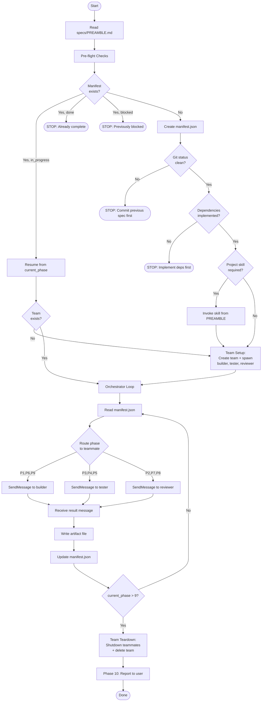

# Plan: Convert implement-spec to Persistent Agent Teams

## Context

The current implement-spec skill spawns a **fresh Task agent** for every phase (1-9). Each agent starts with zero context and must be given everything via a large prompt (PREAMBLE + phase template + artifacts). This is wasteful — especially during fix loops where Phase 6 (fix) has to re-learn the entire codebase that Phase 1 (implement) just wrote.

This plan converts the skill to use **persistent agent teams** (TeamCreate/SendMessage). Teammates retain context across multiple phases, enabling faster fix loops, better error diagnosis, and consistent quality standards.

## Goal

Replace the Task-per-phase dispatch with a 3-teammate team while preserving 100% of the existing manifest/artifact system, phase templates, loop logic, and resume capability.

---

## Team Architecture

### Teammates

| Teammate | Type | Phases | Rationale |
|----------|------|--------|-----------|
| **builder** | general-purpose | 1 (Implement), 6 (Fix), 9 (Commit) | The agent that wrote the code is best positioned to fix it. Retains implementation decisions across fix loops. Knows what files it created for the commit message. |
| **tester** | general-purpose | 3 (Unit Tests), 4 (E2E Tests), 5 (Run Tests) | Writes both test types and runs them. Understands test structure when interpreting failures. Can write unit + e2e tests in consecutive messages without re-learning the codebase. |
| **reviewer** | general-purpose | 2 (Verify), 7 (Screenshots), 8 (Code Review) | All verification/review phases share the same mindset — checking work against the spec. Builds consistent understanding of acceptance criteria across all review phases. |
| **lead** | orchestrator (you) | Pre-flight, manifest, loop logic, Phase 10 | Manages team lifecycle, routes work, writes artifacts, controls loops, reports to user. |

### Phase-to-Teammate Routing

```
Phase 1  (Implement)      → builder
Phase 2  (Verify)         → reviewer
Phase 3  (Unit Tests)     → tester
Phase 4  (E2E Tests)      → tester
Phase 5  (Run Tests)      → tester
Phase 6  (Fix Failures)   → builder
Phase 7  (Screenshots)    → reviewer
Phase 8  (Code Review)    → reviewer
Phase 9  (Commit)         → builder
Phase 10 (Report)         → lead (direct, no message)
```

### Context Retention Wins

These are the concrete improvements over the current Task-per-phase approach:

1. **builder Phase 1 → Phase 6**: When tests fail, the builder already knows WHY it made implementation decisions. No need to re-read every file and re-derive the architecture. This is the biggest win — the fix loop (Phase 5 → 6 → 5 → 6...) can iterate up to 5 times, and each Phase 6 currently starts from scratch.

2. **builder Phase 6 → Phase 6 (subsequent iterations)**: On the second or third fix attempt, the builder remembers what it already tried and failed. No duplicate fixes.

3. **tester Phase 3 → Phase 4**: After writing unit tests, the tester already understands the component structure and can write better E2E tests targeting the same behaviors.

4. **tester Phase 3/4 → Phase 5**: The tester who wrote the tests knows their intent when reading failure output. Better root cause identification.

5. **reviewer Phase 2 → Phase 7 → Phase 8**: The reviewer builds a deep understanding of the spec's acceptance criteria in Phase 2, then applies that same understanding when reviewing screenshots and code quality.

6. **builder Phase 1 → Phase 9**: The builder has full implementation context for writing a meaningful commit message.

### Team Lifecycle

**One team per spec.** This prevents context from one spec's domain (e.g., payment page) bleeding into another spec's domain (e.g., transaction history).

```
/implement-spec NN
  ├── Pre-flight checks (lead)
  ├── Team Setup: Create team "spec-NN", spawn builder/tester/reviewer
  ├── Orchestrator Loop: Route phases to teammates via SendMessage
  ├── Team Teardown: Shutdown teammates, delete team
  └── Phase 10: Report (lead)
```

When running the IMPLEMENT.md outer loop across all 15 specs:
```
spec 01: create team → implement → teardown → compact
spec 02: create team → implement → teardown → compact
...
spec 15: create team → implement → teardown → compact
```

---

## What Stays the Same

These components are **100% preserved** — no changes whatsoever:

### Manifest System
- Schema: `progress/spec-NN/manifest.json` with spec_number, status, current_phase, next_sequence, iterations, phases
- Phase statuses: pending → in_progress → done
- Spec statuses: in_progress → done | blocked
- Manifest is read before every phase and updated after every phase

### Artifact System
- Naming: `{sequence:03d}-p{phase:02d}-{slug}.json`
- Storage: `progress/spec-NN/`
- Slugs: implement, verify, unit-tests, e2e-tests, run-tests, fix, screenshots, code-review, commit
- Dependency table: Which phases need artifacts from which prior phases
- `latest` pointer in manifest always points to most recent artifact per phase

### Phase Templates (Content)
- All 9 phase templates remain word-for-word identical
- The TASK, INPUTS, REQUIREMENTS, RETURN JSON blocks are unchanged
- These templates are now sent as message content instead of Task prompts, but the text is the same

### Loop Logic
- Verify loop: Phase 2 fails → Phase 1 (max 3 attempts)
- Test fix loop: Phase 5 fails → Phase 6 → Phase 5 (max 5 attempts)
- Screenshot loop: Phase 7 issues → Phase 6 → Phase 5 (shares test_fix count)
- Refactor loop: Phase 8 needs refactor → Phase 6 → Phase 5 (max 3 attempts)

### Pre-flight Checks
- Check existing manifest (resume/done/blocked)
- Read PREAMBLE, spec file, dependencies
- Check for uncommitted git changes
- Check project-specific skills
- Check for cached documentation

### PREAMBLE System
- Generated by INIT.md (unchanged)
- Injected into agent prompts (now teammate messages)
- Contains project context, coding standards, test commands, import rules

### Placeholder System
- All 14 placeholders: {{SPEC_NUMBER}}, {{SPEC_PATH}}, {{FILES_CREATED}}, etc.
- Filled by lead before sending to teammate

### Resume Capability
- Manifest on disk is the source of truth
- Re-running `/implement-spec NN` resumes from current_phase
- New team gets created on resume (teammates start fresh but get PREAMBLE + artifact context)

### Other Unchanged Files
- `INIT.md` — Uses parallel Task spawns for PREAMBLE generation (different workflow, not phase execution)
- `docs/e2e-test-output.md` — Reference documentation for Phase 5
- `.claude/settings.json` — Already has `CLAUDE_CODE_EXPERIMENTAL_AGENT_TEAMS: true`
- All spec files, PRD.md, ALIGN_SPEC_PROMPT.md

---

## What Changes

### Files Modified

| File | Change Type | Scope |
|------|-------------|-------|
| `.claude/skills/implement-spec/SKILL.md` | Major edit | ~10 sections modified/added |
| `IMPLEMENT.md` | Minor edit | 4 small text updates |

### Files NOT Modified

| File | Reason |
|------|--------|
| `INIT.md` | Uses Task spawns for PREAMBLE gen — different workflow |
| `docs/e2e-test-output.md` | Reference doc, no dispatch logic |
| `.claude/settings.json` | Already has teams enabled |
| `.claude/settings.local.json` | Already has teams enabled |

---

## Detailed SKILL.md Changes

### Change 1: Description (Line 3)

**Current:**
```
A generic workflow for implementing specs from a `specs/` directory using sub-agents with fresh context for each phase.
```

**New:**
```
A generic workflow for implementing specs from a `specs/` directory using persistent agent teams with retained context across phases.
```

---

### Change 2: Workflow Flowchart (Lines 17-46)

**Replace** the entire mermaid flowchart. New version adds Team Setup after pre-flight/resume, routes phases to specific teammates (builder/tester/reviewer), and adds Team Teardown before Phase 10.



---

### Change 3: Critical Rules (Lines 50-62)

**Replace** the entire CRITICAL RULES section with updated rules:

```markdown
## CRITICAL RULES

1. For EACH phase, send a message to the appropriate teammate via `SendMessage` (see Teammate Role Assignments)
2. **Send `specs/PREAMBLE.md` contents in each teammate's FIRST message only** — subsequent messages include a reference reminder instead
3. **Replace all `{{PLACEHOLDERS}}` with actual values**
4. Pass ONLY essential context between phases — read the `latest` artifact from the manifest, not full conversation history
5. **Read and update `progress/spec-NN/manifest.json` before and after EVERY phase**
6. After each teammate responds, the **lead** writes the artifact file and updates the manifest
7. Respect iteration limits — STOP and report if exceeded
8. **DO NOT** proceed to a phase unless the manifest shows it as the `current_phase`
9. **DO NOT** do any phase work inline — every phase goes through a teammate message
10. **Teammates may handle consecutive phases of their type** (e.g., tester receives Phase 3 then Phase 4 as separate messages), but each phase is still a separate message/response cycle with its own artifact
11. **Tasks (TaskCreate/TaskUpdate) are for spec-level tracking only** (e.g., "Implement spec 08"). DO NOT create tasks for individual phases — the manifest handles phase tracking.
12. **Create exactly ONE team per spec.** Tear it down after Phase 10. Do NOT reuse teams across specs.
13. **If a teammate fails to respond**, retry once. If still no response, fall back to spawning a fresh Task agent (subagent_type: "general-purpose") for that single phase only.
```

Key changes from current rules:
- Rule 1: "spawn a Task agent" → "send message to appropriate teammate"
- Rule 2: Changed from "prepend PREAMBLE to every prompt" → "first message only"
- Rule 10: Changed from "DO NOT combine multiple phases" → "teammates handle consecutive phases as separate messages"
- Rules 12-13: New (team lifecycle, fallback)

---

### Change 4: New Section — Teammate Role Assignments

**Insert** after CRITICAL RULES, before the prompt construction section.

This section contains:
- Role table: teammate name, agent type, phases, responsibilities
- Phase-to-Teammate Routing lookup (the dispatch table the orchestrator uses)
- Context Retention Wins (explains WHY each grouping was chosen)

Full content is provided in the Team Architecture section of this plan above.

---

### Change 5: Rename + Replace Prompt Construction Section (Lines 66-82)

**Current title:** "HOW TO CONSTRUCT SUB-AGENT PROMPTS"
**New title:** "HOW TO CONSTRUCT TEAMMATE MESSAGES"

**Replace** the diagram and content. New version shows two message templates:

**First message to a teammate:**
```
┌─────────────────────────────────────┐
│  Contents of specs/PREAMBLE.md      │
│  (project context, standards, etc.) │
├─────────────────────────────────────┤
│  [PHASE N: PHASE_NAME]             │
│  Phase template with {{FILLED}}     │
│  placeholder values                 │
├─────────────────────────────────────┤
│  CONTEXT FROM PREVIOUS PHASES:      │
│  - Artifact data per dependency     │
│    table                            │
│  - Iteration counts from manifest   │
└─────────────────────────────────────┘
```

**Subsequent messages to same teammate:**
```
┌─────────────────────────────────────┐
│  PREAMBLE REMINDER: "Refer to the  │
│  PREAMBLE provided in your initial  │
│  message for project context,       │
│  coding standards, test structure." │
├─────────────────────────────────────┤
│  [PHASE N: PHASE_NAME]             │
│  Phase template with {{FILLED}}     │
│  placeholder values                 │
├─────────────────────────────────────┤
│  CONTEXT FROM PREVIOUS PHASES:      │
│  - Artifact data per dependency     │
│    table                            │
│  - Iteration counts from manifest   │
└─────────────────────────────────────┘
```

Also add:

**Message framing convention** — Phase headers help teammates track which phase they're executing:
- Lead sends: `[PHASE N: PHASE_NAME]`
- Teammate responds: `[PHASE N RESULT]` followed by JSON artifact

**PREAMBLE tracking** — The lead maintains a mental flag per teammate:
```
preamble_sent = { builder: false, tester: false, reviewer: false }
```
Set to `true` after first message to each teammate.

---

### Change 6: New Section — Team Setup

**Insert** between PRE-FLIGHT CHECKS and ORCHESTRATOR LOOP.

Content:

#### Steps
1. **Create the team:**
   ```
   TeamCreate({
     team_name: "spec-{SPEC_NUMBER}",
     description: "Implementing spec {SPEC_NUMBER}: {SPEC_NAME}"
   })
   ```

2. **Spawn all three teammates in a SINGLE message** (parallel initialization):
   ```
   // All three in one message for parallel spawn:

   Task({
     team_name: "spec-{SPEC_NUMBER}",
     name: "builder",
     subagent_type: "general-purpose",
     prompt: "You are the BUILDER teammate on team spec-{SPEC_NUMBER}.

   YOUR ROLE: Implement code (Phase 1), fix test/review failures (Phase 6), and commit (Phase 9).

   WORKFLOW:
   - The lead will send you phase assignments via message
   - Each message contains a [PHASE N: NAME] header and detailed instructions
   - Do the work described (read files, write code, run commands as needed)
   - Respond with ONLY a [PHASE N RESULT] header followed by the JSON artifact described in the instructions
   - Do NOT take any action until you receive a phase assignment

   Wait for your first assignment."
   })

   Task({
     team_name: "spec-{SPEC_NUMBER}",
     name: "tester",
     subagent_type: "general-purpose",
     prompt: "You are the TESTER teammate on team spec-{SPEC_NUMBER}.

   YOUR ROLE: Write unit tests (Phase 3), write E2E tests (Phase 4), and run all tests (Phase 5).

   WORKFLOW:
   - The lead will send you phase assignments via message
   - Each message contains a [PHASE N: NAME] header and detailed instructions
   - Do the work described (read files, write tests, run test commands as needed)
   - Respond with ONLY a [PHASE N RESULT] header followed by the JSON artifact described in the instructions
   - Do NOT take any action until you receive a phase assignment

   Wait for your first assignment."
   })

   Task({
     team_name: "spec-{SPEC_NUMBER}",
     name: "reviewer",
     subagent_type: "general-purpose",
     prompt: "You are the REVIEWER teammate on team spec-{SPEC_NUMBER}.

   YOUR ROLE: Verify implementation (Phase 2), review screenshots (Phase 7), and code review (Phase 8).

   WORKFLOW:
   - The lead will send you phase assignments via message
   - Each message contains a [PHASE N: NAME] header and detailed instructions
   - Do the work described (read files, check criteria, review images as needed)
   - Respond with ONLY a [PHASE N RESULT] header followed by the JSON artifact described in the instructions
   - Do NOT take any action until you receive a phase assignment

   Wait for your first assignment."
   })
   ```

3. **Initialize PREAMBLE tracking:**
   ```
   preamble_sent = { builder: false, tester: false, reviewer: false }
   ```

#### Resume Handling
When resuming from a manifest (`status: "in_progress"`), the team must still be created fresh — teams do not persist across sessions. The manifest tells the lead which phase to resume from, so no work is lost. Teammates start with clean context on resume, but receive PREAMBLE + relevant artifact context in their first message, which matches the information a fresh Task agent would have received in the current system.

---

### Change 7: Replace Orchestrator Loop (Lines 227-274)

**Replace** the entire ORCHESTRATOR LOOP section. The new version:

1. Reads manifest (same)
2. **Determines teammate** for current phase (new — uses routing table)
3. **Constructs message** with PREAMBLE-aware logic (new — first vs subsequent)
4. **Sends via SendMessage** instead of spawning Task (changed)
5. **Receives response** automatically (teammates send messages back)
6. Parses JSON, writes artifact, updates manifest (same)
7. Applies loop logic (same)
8. If current_phase > 9: **Team Teardown** then Phase 10 (new)

```
1. Read progress/spec-NN/manifest.json
2. phase = current_phase from manifest
3. Determine teammate for this phase (Phase-to-Teammate Routing table)
4. Construct the message:
   a. If preamble_sent[teammate] is false:
      - Prepend full PREAMBLE contents
      - Set preamble_sent[teammate] = true
   b. If preamble_sent[teammate] is true:
      - Prepend PREAMBLE reminder text
   c. Add phase header: [PHASE {N}: {PHASE_NAME}]
   d. Append phase template with filled placeholders
   e. Append artifact context from previous phases (per Dependency Table)
5. Send message to teammate:
   SendMessage({
     type: "message",
     recipient: "{teammate}",
     content: "{constructed message}",
     summary: "Phase {N}: {phase_name} for spec {SPEC_NUMBER}"
   })
6. Wait for teammate's response message (automatic delivery)
7. Parse JSON artifact from response
8. Write artifact to progress/spec-NN/{next_sequence:03d}-p{phase:02d}-{slug}.json
9. Update manifest.json:
   a. Update phase's "latest" to point to the new artifact filename
   b. Increment next_sequence
   c. Apply LOOP LOGIC (from the phase's section) to determine next current_phase
   d. Write updated manifest
10. If current_phase > 9: proceed to TEAM TEARDOWN, then Phase 10
11. Otherwise: go to step 1
```

Also update the existing Example section (currently "Preparing Phase 8 Prompt") to show how the message is constructed and sent via SendMessage to the reviewer teammate.

#### Teammate Failure Handling

Add a subsection describing the fallback:

```
If a teammate does not respond or sends invalid JSON:
1. Send a follow-up message asking them to re-send as JSON only
2. If second attempt fails:
   a. Log the failure
   b. Fall back to spawning a fresh Task agent for this phase:
      Task({
        subagent_type: "general-purpose",
        prompt: "{full prompt with PREAMBLE + phase template + artifacts}"
      })
   c. Continue the orchestrator loop with the Task agent's response
   d. The teammate remains available in the team for future phases
```

---

### Change 8: Phase Header Annotations

**Add routing hints** to each phase section header. Single-line edits, 9 total:

| Current Header | New Header |
|---------------|------------|
| `## PHASE 1: IMPLEMENT` | `## PHASE 1: IMPLEMENT (→ builder)` |
| `## PHASE 2: VERIFY IMPLEMENTATION` | `## PHASE 2: VERIFY IMPLEMENTATION (→ reviewer)` |
| `## PHASE 3: UNIT TESTS` | `## PHASE 3: UNIT TESTS (→ tester)` |
| `## PHASE 4: E2E TESTS` | `## PHASE 4: E2E TESTS (→ tester)` |
| `## PHASE 5: RUN TESTS` | `## PHASE 5: RUN TESTS (→ tester)` |
| `## PHASE 6: FIX FAILURES` | `## PHASE 6: FIX FAILURES (→ builder)` |
| `## PHASE 7: REVIEW SCREENSHOTS` | `## PHASE 7: REVIEW SCREENSHOTS (→ reviewer)` |
| `## PHASE 8: CODE REVIEW` | `## PHASE 8: CODE REVIEW (→ reviewer)` |
| `## PHASE 9: FINALIZE & COMMIT` | `## PHASE 9: FINALIZE & COMMIT (→ builder)` |

**No changes** to the phase template content, RETURN JSON blocks, or LOOP LOGIC blocks within any phase.

---

### Change 9: New Section — Team Teardown

**Insert** after Phase 9 section, before Phase 10.

Content:

```markdown
## TEAM TEARDOWN

After the orchestrator loop completes (current_phase > 9) OR when status is set to "blocked":

1. **Send shutdown requests to all teammates:**
   SendMessage({ type: "shutdown_request", recipient: "builder", content: "Spec complete." })
   SendMessage({ type: "shutdown_request", recipient: "tester", content: "Spec complete." })
   SendMessage({ type: "shutdown_request", recipient: "reviewer", content: "Spec complete." })

2. **Wait for shutdown confirmations** (each teammate responds with shutdown_response approval)

3. **Delete the team:**
   TeamDelete()

### Blocked Teardown
If the spec is blocked (iteration limit exceeded), still tear down the team. The manifest preserves
all state needed for a future resume attempt, which will create a new team.

### Non-Response During Teardown
If a teammate does not respond to shutdown within a reasonable time, proceed with TeamDelete() anyway.
```

---

### Change 10: Phase 10 Section (Lines 680-695)

**Minor text update** — add reference to team teardown:

```markdown
## PHASE 10: REPORT

Phase 10 is **NOT** a teammate message. The lead handles this directly, AFTER team teardown.
```

Rest of Phase 10 content stays the same.

---

## IMPLEMENT.md Changes

Four small text updates:

### 1. Line 3 — Description
Add mention of agent teams:
```
Run each spec sequentially using `/implement-spec`. Each spec creates a persistent agent team
(builder, tester, reviewer) for the duration of that spec's implementation, then tears it down.
Each spec handles its own commit and tag via Phase 9 — no manual git steps needed between specs.
```

### 2. Lines 7-8 — Resume note
Add note about team recreation:
```
**Resume:** If context is lost mid-spec, just re-run `/implement-spec XX`. The manifest at
`progress/spec-XX/manifest.json` tracks phase-level state, so it picks up exactly where it left off.
A new team is created on resume — teammates start fresh but receive full context from artifacts.
```

### 3. Line 32 — Compact focus text
Add team teardown mention:
```
/compact Completed spec XX (team torn down). Next: spec YY ([spec name]).
Task list tracks progress. Ready to continue with /implement-spec YY.
```

### 4. Lines 91-94 — Notes section
Add team bullet:
```
**Notes:**
- Each spec creates a team (builder, tester, reviewer), implements, and tears it down
- Each spec commits and tags automatically (Phase 9)
- If context lost mid-spec, re-run `/implement-spec XX` — manifest handles resume, new team is created
- The task list survives compaction — it's your source of truth for progress
```

---

## Implementation Order

Execute edits to SKILL.md **top-down** to minimize line-number drift:

| Step | Section | Action | Approx Lines |
|------|---------|--------|-------------|
| 1 | Line 3 | Edit description text | 1 line |
| 2 | Lines 17-46 | Replace flowchart | ~30 → ~45 |
| 3 | Lines 50-62 | Replace Critical Rules | ~13 → ~13 |
| 4 | After rules | Insert Teammate Role Assignments | +45 |
| 5 | Lines 66-82 | Rename + replace prompt construction | ~17 → ~60 |
| 6 | After pre-flight | Insert Team Setup | +70 |
| 7 | Lines 227-274 | Replace Orchestrator Loop | ~48 → ~65 |
| 8 | Phase headers | Add routing hints (9 edits) | 9 × 1 line |
| 9 | After Phase 9 | Insert Team Teardown | +35 |
| 10 | Lines 680-682 | Update Phase 10 intro text | 2 lines |
| 11 | IMPLEMENT.md | 4 small text updates | ~8 lines |

**Estimated final SKILL.md size:** ~1000 lines (up from 754)

---

## Risk Assessment

| Risk | Likelihood | Impact | Mitigation |
|------|-----------|--------|------------|
| Teammate goes idle/unresponsive | Low | Medium (delays phase) | Retry once, then fall back to Task spawn for that phase |
| Team name collision | Very low | Low | Names include spec number: `spec-08` |
| PREAMBLE compressed out of teammate context | Low | Medium (quality drop) | Teammates typically have only 3-5 turns; well within context limits |
| Resume creates new team, builder loses prior context | Expected | None | Artifacts on disk provide all context; matches current Task behavior on resume |
| Teammates produce non-JSON responses | Low | Low | Message framing convention + instructions in spawn prompt + retry |

## Verification

After implementation:
1. **Read SKILL.md end-to-end** and verify the flow is coherent
2. **Check all 9 phase templates** are unchanged (content only, not headers)
3. **Verify flowchart** matches the new dispatch logic
4. **Verify Critical Rules** are internally consistent
5. **Verify Teammate Role Assignments** covers all 9 phases
6. **Verify Team Setup** spawns all 3 teammates correctly
7. **Verify Team Teardown** shuts down all 3 teammates
8. **Verify IMPLEMENT.md** references are updated
9. **Dry-run**: Mentally trace a spec through the full flow (Phase 1 through 10) including one test-fix loop iteration, confirming manifest updates, teammate routing, and artifact handling are correct
